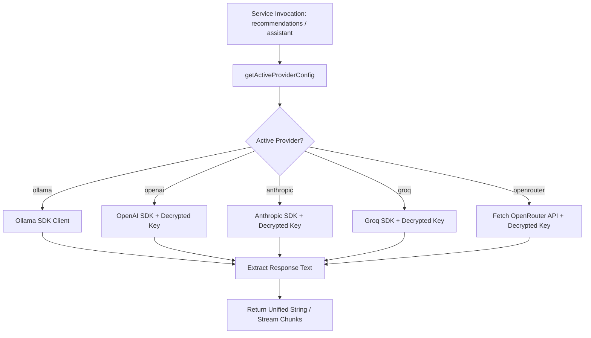
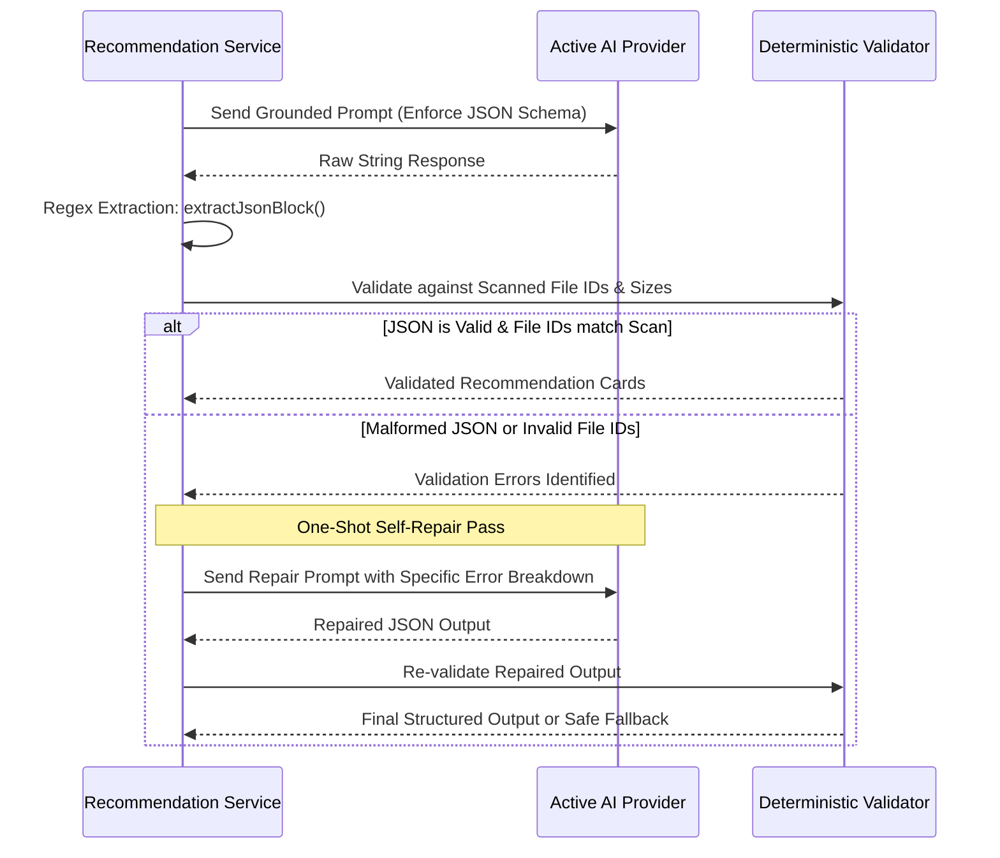
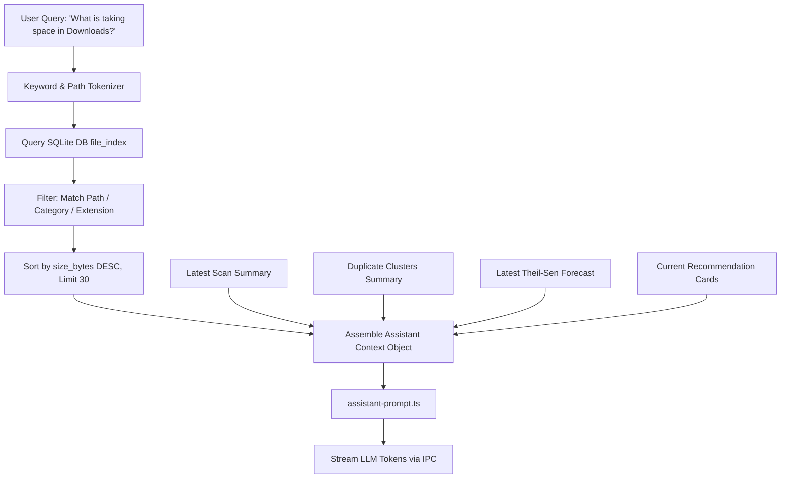
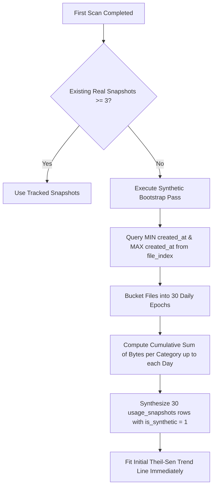
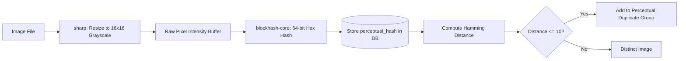
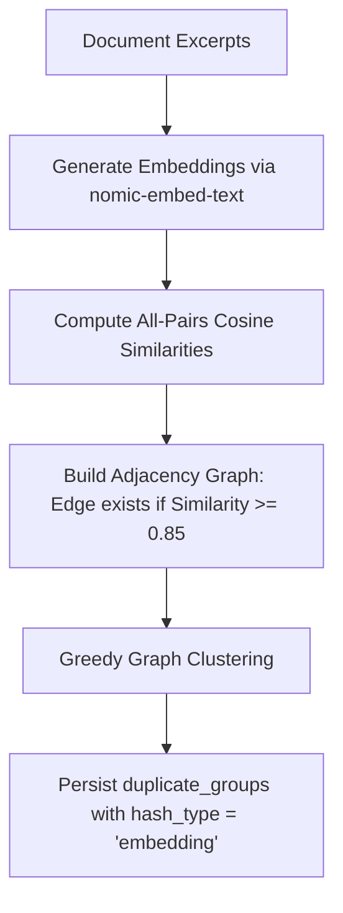

# Horizon — Complete Technical & Architectural Analysis

## Table of Contents
1. [System Architecture & Core Philosophy](#1-system-architecture--core-philosophy)
2. [Multi-Provider AI Architecture & System Layer](#2-multi-provider-ai-architecture--system-layer)
   - 2.1 Provider Abstraction Layer (`llm-client.ts`)
   - 2.2 Secure Storage & Secret Management (`secure-storage.ts`)
   - 2.3 Grounded Prompt Construction & Privacy Invariants
   - 2.4 Structured JSON Parsing, Validation & One-Shot Self-Repair Loop
3. [AI Recommendations Generation Pipeline](#3-ai-recommendations-generation-pipeline)
   - 3.1 Triggering Lifecycle & State Machine
   - 3.2 Metadata-Only Context Extraction (`recommendation-context.ts`)
   - 3.3 Rule-Grounded Prompt Engineering (`recommendation-prompt.ts`)
   - 3.4 Deterministic Validator (`recommendation-validator.ts`)
   - 3.5 Database Schema & Persistence Model
4. [Grounded AI Chat Assistant Pipeline](#4-grounded-ai-chat-assistant-pipeline)
   - 4.1 Keyword & Context Retrieval Step (`assistant-retrieval.ts`)
   - 4.2 Strict Guardrail System Prompt (`assistant-prompt.ts`)
   - 4.3 Streaming Execution Engine (`assistant.ts`)
5. [Storage Forecasting & Predictive Modeling Engine](#5-storage-forecasting--predictive-modeling-engine)
   - 5.1 Historical Usage Snapshots & Background Capture (`scheduler.ts`)
   - 5.2 Synthetic First-Run Bootstrap Algorithm
   - 5.3 Theil-Sen Robust Median Regression Model (`forecasting.ts`)
   - 5.4 Mathematical Formulation & Non-Parametric Confidence Bounds
   - 5.5 Projected "Full-by" Date & Horizon Computation
   - 5.6 Category-Level Segmentation & Cleanup Invalidation (`segment_id`)
   - 5.7 Interactive What-If Simulation Engine
6. [Multi-Tier Duplicate Detection & Vector Embeddings](#6-multi-tier-duplicate-detection--vector-embeddings)
   - 6.1 Multi-Tier Detection Overview
   - 6.2 Tier 1: Exact Hash Duplication (Chunked SHA-256 & Workers)
   - 6.3 Tier 2: Perceptual Image Hashing (`sharp` + `blockhash-core`)
   - 6.4 Tier 3: Vector Embeddings & Document Near-Duplicate Clustering (`embeddings.ts`)
   - 6.5 Cosine Similarity & Greedy Graph Clustering Mathematics
   - 6.6 "Recommended Keep" Heuristics & Selection Logic
   - 6.7 Database Schemas & Soft Deletion Cascade
7. [Invariants & System Safety Matrix](#7-invariants--system-safety-matrix)

---

## 1. System Architecture & Core Philosophy

Horizon is a local-first desktop application engineered with a single-runtime architecture: Electron with TypeScript across the main process, preload bridge, and React 19 renderer. Unlike legacy cleaner utilities, Horizon enforces strict non-negotiable architectural guarantees:

```
+-----------------------------------------------------------------------------+
|                               RENDERER PROCESS                              |
|   React 19 + Vite + Tailwind CSS v4 + Radix UI + TanStack Query + Recharts  |
+-----------------------------------------------------------------------------+
                                       |
                   Typed IPC Bridge (packages/shared-types)
                        Preload (contextBridge allowlist)
                                       |
+-----------------------------------------------------------------------------+
|                             MAIN PROCESS (Node.js)                          |
|                                                                             |
|  +-----------------------+  +----------------------+  +------------------+  |
|  |     AI Engine         |  |  Forecasting Engine  |  | Duplicate Engine |  |
|  |  - llm-client.ts      |  |  - forecasting.ts    |  | - hashing.ts     |  |
|  |  - recommendations.ts |  |  - scheduler.ts      |  | - embeddings.ts  |  |
|  |  - assistant.ts       |  |  - Theil-Sen Median  |  | - hash.worker.ts |  |
|  +-----------------------+  +----------------------+  +------------------+  |
|                                                                             |
|  +-----------------------------------------------------------------------+  |
|  |             Safety & Deletion Subsystem (trash.ts + policy)           |  |
|  +-----------------------------------------------------------------------+  |
|  |             Persistence Layer: SQLite (better-sqlite3 + Drizzle)      |  |
|  +-----------------------------------------------------------------------+  |
+-----------------------------------------------------------------------------+
```

### Core Architectural Invariants
1. **No External Backend Server:** All scanning, time-series regression, embedding computations, SQLite queries, and secure key operations run inside the local Electron process.
2. **Main Process Trust Boundary:** The renderer process is untrusted. All IPC arguments are validated at runtime using Zod schemas (`packages/shared-types`) before execution.
3. **Reversible Actions Only (Trash-First):** No code path performs a permanent unlink (`fs.unlink`). Deletions use the OS trash via `trash.ts` preceded by deterministic `deletion-policy.ts` validation.
4. **Zero Content Leakage (Privacy-First):** AI prompts receive only metadata (file paths, file sizes, categories, timestamps, category aggregates). Raw user file contents are never read or transmitted to LLMs.

---

## 2. Multi-Provider AI Architecture & System Layer

### 2.1 Provider Abstraction Layer (`llm-client.ts`)

Horizon implements a provider-agnostic LLM client supporting five distinct AI providers:

| Provider | Default Model | Mode | Transport / SDK | Key Storage |
| :--- | :--- | :--- | :--- | :--- |
| **Ollama** *(Default)* | `llama3.2:3b` | Local / Remote | `ollama` SDK via HTTP | None (Local) or Base URL |
| **OpenAI** | `gpt-4o-mini` | Cloud (BYOK) | `openai` SDK | OS `safeStorage` |
| **Anthropic** | `claude-3-5-haiku-latest` | Cloud (BYOK) | `@anthropic-ai/sdk` | OS `safeStorage` |
| **Groq** | `llama-3.1-8b-instant` | Cloud (BYOK) | `groq-sdk` | OS `safeStorage` |
| **OpenRouter** | `meta-llama/llama-3.2-3b-instruct`| Cloud (BYOK)| Native Fetch (OpenAI compatible)| OS `safeStorage` |

#### Zero-Config Local Default & Remote Ollama
On application startup, `ensureDefaultAiConfig()` automatically registers Ollama as the active provider with `isActive = 1`. If the user runs Ollama on another machine or port, Horizon stores a custom `baseUrl` in the `ai_provider_config` table:

```typescript
export function getOllamaHost(): string {
  try {
    const stored = db
      .select()
      .from(aiProviderConfig)
      .where(eq(aiProviderConfig.providerName, "ollama"))
      .get();
    return stored?.baseUrl || "http://127.0.0.1:11434";
  } catch {
    return "http://127.0.0.1:11434";
  }
}
```

#### Unified Execution Contract
Both streaming and non-streaming calls are routed through a single entry point:

```typescript
export interface LlmCompletionOptions {
  systemPrompt?: string;
  temperature?: number;
  maxTokens?: number;
  formatJson?: boolean;
}

export async function generateCompletion(
  prompt: string,
  options?: LlmCompletionOptions
): Promise<string>
```



---

### 2.2 Secure Storage & Secret Management (`secure-storage.ts`)

API keys are managed following strict security principles (Invariant **I-5**):

```
+-------------------+      safeStorage.encryptString()      +-----------------------+
|  Plaintext Key    | ------------------------------------> | Encrypted Buffer/Blob |
| (in memory only)  |                                       | (stored on disk/store)|
+-------------------+                                       +-----------------------+
          ^                                                             |
          |                 safeStorage.decryptString()                 |
          +-------------------------------------------------------------+
```

1. **OS Hardware/Keychain Backed Encryption:** Electron's `safeStorage` API encrypts keys using platform-native security primitives:
   - **macOS:** Keychain Access
   - **Windows:** DPAPI (Data Protection API)
   - **Linux:** `libsecret` / Secret Service API
2. **No IPC Leaks:** IPC handlers never return raw API keys to the renderer. Only Boolean presence flags (`hasKey: true`) or masked strings (`sk-...1234`) are exposed.
3. **Decryption at Invocation Time:** The plaintext key is decrypted exclusively in the main process right before making the outbound HTTPS request and discarded from memory immediately after.

---

### 2.3 Grounded Prompt Construction & Privacy Invariants

To eliminate privacy risks and satisfy Invariant **I-6**:
- **Prohibited:** File buffers, image binary payloads, raw document bodies, code contents, or personal document text.
- **Permitted:** Anonymized scan summary statistics, total file counts, byte sizes, folder categories, file paths, file extensions, access/modification timestamps, and linear regression slopes.

---

### 2.4 Structured JSON Parsing, Validation & One-Shot Self-Repair Loop

LLMs occasionally return JSON wrapped in markdown codeblocks (` ```json ... ``` `) or conversational preambles. Horizon enforces a robust extraction and deterministic self-repair pipeline:



#### JSON Block Extraction Logic
```typescript
export function extractJsonBlock(rawText: string): string {
  const codeBlockMatch = rawText.match(/```(?:json)?\s*([\s\S]*?)\s*```/);
  if (codeBlockMatch && codeBlockMatch[1]) {
    return codeBlockMatch[1].trim();
  }
  const firstBracket = rawText.indexOf("[");
  const firstBrace = rawText.indexOf("{");
  if (firstBracket !== -1 && (firstBrace === -1 || firstBracket < firstBrace)) {
    const lastBracket = rawText.lastIndexOf("]");
    if (lastBracket > firstBracket) {
      return rawText.substring(firstBracket, lastBracket + 1).trim();
    }
  }
  if (firstBrace !== -1) {
    const lastBrace = rawText.lastIndexOf("}");
    if (lastBrace > firstBrace) {
      return rawText.substring(firstBrace, lastBrace + 1).trim();
    }
  }
  return rawText.trim();
}
```

---

## 3. AI Recommendations Generation Pipeline

### 3.1 Triggering Lifecycle & State Machine

AI recommendations run automatically upon the completion of duplicate group detection:

```
[Scan Completed] ---> [Duplicate Detection Finished] ---> [generateRecommendationsForScan()]
                                                                      |
                                             +------------------------+-----------------------+
                                             |                                                |
                                    [Active AI Available]                            [No Active Provider]
                                             |                                                |
                                  Assemble Context (I-6)                             Persist 'no_results' batch
                                             |                                       status in SQLite
                                  Construct LLM Prompt
                                             |
                                  Generate Completion
                                             |
                                 Deterministic Validation
                                             |
                                  +----------+----------+
                                  |                     |
                              [Passed]               [Failed]
                                  |                     |
                        Save to SQLite DB        One-Shot Repair
                                                        |
                                              +---------+---------+
                                              |                   |
                                          [Repaired]       [Persist Failed]
```

### 3.2 Metadata-Only Context Extraction (`recommendation-context.ts`)

The context builder constructs a structured summary from SQLite:
1. **Scope & Volume Summary:** Total scanned files, total bytes, scan duration.
2. **Category Distribution:** Byte breakdown across `dev_artifact`, `archive`, `video`, `image`, `document`, `other`.
3. **Duplicate Groups Summary:** Exact, perceptual, and embedding duplicate clusters, item counts, and reclaimable bytes.
4. **Stale/Unused Candidates:** Files not accessed for $>180$ days with high disk footprint.
5. **Forecast Signals:** Projected full-by date, runway horizon days, and fastest-growing category.

### 3.3 Rule-Grounded Prompt Engineering (`recommendation-prompt.ts`)

The prompt strictly constrains recommendation targets:
- `targetTab`: Must be one of `duplicates`, `unused`, `large_files`, `forecast`, `overview`.
- `recommendationType`: Must be one of `duplicate`, `unused`, `large_file`, `archive`, `forecast`, `cleanup`.
- `priority`: Integer from 1 (lowest) to 5 (urgent).
- `relatedFileIds`: Must reference real, non-removed file IDs from the current scan context.

### 3.4 Deterministic Validator (`recommendation-validator.ts`)

The validator checks every card:
- **Reference Integrity:** All `relatedFileIds` must exist in the scan's `file_index`.
- **Reasoning Sanity:** Verifies claim consistency (e.g., if claiming to free 2.4 GB, verifies that referenced files total approximately 2.4 GB).
- **Schema Conformity:** Rejects cards with unknown tabs or invalid priority levels.

### 3.5 Database Schema & Persistence Model

Recommendations use a two-table relational structure in SQLite:

```sql
CREATE TABLE `recommendation_batches` (
  `id` integer PRIMARY KEY AUTOINCREMENT NOT NULL,
  `scan_run_id` integer NOT NULL,
  `generation_id` text NOT NULL UNIQUE,
  `source_forecast_id` integer,
  `status` text NOT NULL, -- 'running' | 'complete' | 'no_results' | 'failed' | 'stale'
  `error_category` text,
  `error_message` text,
  `provider` text,
  `model_name` text,
  `started_at` text NOT NULL,
  `completed_at` text,
  FOREIGN KEY (`scan_run_id`) REFERENCES `scan_runs`(`id`)
);

CREATE TABLE `recommendations` (
  `id` integer PRIMARY KEY AUTOINCREMENT NOT NULL,
  `scan_run_id` integer NOT NULL,
  `batch_id` integer NOT NULL,
  `generation_id` text NOT NULL,
  `recommendation_type` text NOT NULL,
  `title` text NOT NULL,
  `reason` text NOT NULL,
  `priority` integer NOT NULL,
  `related_file_ids_json` text NOT NULL,
  `target_tab` text NOT NULL,
  `action` text NOT NULL DEFAULT 'review',
  `status` text NOT NULL DEFAULT 'pending', -- 'pending' | 'accepted' | 'dismissed'
  `provider` text,
  `model_name` text,
  `created_at` text NOT NULL,
  FOREIGN KEY (`batch_id`) REFERENCES `recommendation_batches`(`id`) ON DELETE CASCADE
);
```

---

## 4. Grounded AI Chat Assistant Pipeline

### 4.1 Keyword & Context Retrieval Step (`assistant-retrieval.ts`)

When a user asks a free-form question (e.g. *"What is taking up space in my Downloads folder?"*):



1. **Tokenization:** Extracts alphanumeric keywords and path patterns (e.g. `downloads`, `cache`, `node_modules`, `.dmg`).
2. **Targeted DB Query:** Selects active files from `file_index` matching the search terms, sorted descending by size.
3. **Context Injection:** Injects top matched files, category breakdowns, duplicate stats, and forecast metrics into the prompt.

### 4.2 Strict Guardrail System Prompt (`assistant-prompt.ts`)

```
You are Horizon Assistant, an expert storage management and filesystem assistant.
Your answers MUST be strictly grounded in the provided scan summary, file listings,
duplicate groups, and forecasting data.

RULES:
1. NEVER invent files, paths, or sizes that are not in the context.
2. If data is insufficient, state clearly that the scan data does not show it.
3. Never recommend destructive shell commands (e.g. rm -rf).
4. Direct the user to Horizon's built-in tabs (Duplicates, Unused Files, Large Files, Archive).
```

### 4.3 Streaming Execution Engine (`assistant.ts`)

The assistant streams generated tokens chunk-by-chunk to the renderer over IPC:
1. `ipcRenderer.invoke('assistant:chat', { message, scanRunId })` starts generation.
2. `assistant.ts` connects to the active provider's streaming iterator.
3. Each token is dispatched via `win.webContents.send('assistant:stream', { streamId, chunk, done: false })`.
4. When finished, a final event `{ streamId, chunk: '', done: true }` closes the stream.

---

## 5. Storage Forecasting & Predictive Modeling Engine

### 5.1 Historical Usage Snapshots & Background Capture (`scheduler.ts`)

Horizon tracks long-term disk consumption by taking regular snapshots of storage volume metrics and category allocations:

```sql
CREATE TABLE `usage_snapshots` (
  `id` integer PRIMARY KEY AUTOINCREMENT NOT NULL,
  `snapshot_date` text NOT NULL UNIQUE, -- 'YYYY-MM-DD'
  `captured_at` text NOT NULL,          -- ISO timestamp
  `volume_total_bytes` integer NOT NULL,
  `volume_used_bytes` integer NOT NULL,
  `volume_free_bytes` integer NOT NULL,
  `is_synthetic` integer DEFAULT 0 NOT NULL
);

CREATE TABLE `usage_snapshot_categories` (
  `id` integer PRIMARY KEY AUTOINCREMENT NOT NULL,
  `snapshot_id` integer NOT NULL,
  `category` text NOT NULL,
  `size_bytes` integer NOT NULL,
  `segment_id` integer DEFAULT 0 NOT NULL,
  FOREIGN KEY (`snapshot_id`) REFERENCES `usage_snapshots`(`id`) ON DELETE CASCADE
);
```

#### Snapshot Triggers
- **Daily Cron Job:** Runs every night at 02:00 (`0 2 * * *`) via `node-cron`.
- **App Boot Trigger:** `captureDailySnapshot()` runs on startup if no snapshot exists for the current calendar date.
- **Post-Scan Trigger:** Updates category statistics for the current day immediately after a scan finishes.

---

### 5.2 Synthetic First-Run Bootstrap Algorithm

A major problem with storage forecasting tools is the **"Day 1 Cold Start"**: on a fresh install, with only 1 data point, linear regression is mathematically impossible.

Horizon solves this by analyzing the distribution of `created_at` timestamps across all files indexed in `file_index` during the first scan:



1. **Date Range Extraction:** Finds the span between the oldest file creation timestamp and current time (capped at 90 days).
2. **Cumulative Backfill:** Groups file sizes by creation day and calculates the cumulative volume curve up to the current total used volume.
3. **Data Source Tagging:** Tagged with `data_source = "bootstrap"`, enabling the UI to visually indicate bootstrapped vs. real day-over-day tracking.

---

### 5.3 Theil-Sen Robust Median Regression Model (`forecasting.ts`)

Standard Ordinary Least Squares (OLS) regression is vulnerable to outliers. For example, downloading a 50 GB game installer or temporary video file would skew an OLS slope upwards, falsely predicting disk exhaustion in 3 days.

Horizon utilizes **Theil-Sen Estimator** (also known as Sen's slope estimator), a non-parametric linear regression model that computes the **median of all pairwise slopes**.

```
         Growth Curve (Bytes vs Days)
Bytes ^
      |                                  / (High Bound - 90th percentile)
      |                            *  --/-- (Theil-Sen Median Slope)
      |                       *      /
      |                  *   .      / (Low Bound - 10th percentile)
      |             *       .
      |      *   [Outlier] .
      |    *               .
      |  *                 .
      +------------------------------------------->
      0                    t_runway           Days
```

---

### 5.4 Mathematical Formulation & Non-Parametric Confidence Bounds

Given $n$ historical data points $(x_1, y_1), (x_2, y_2), \dots, (x_n, y_n)$ where $x_i$ is the day offset and $y_i$ is storage bytes:

#### 1. Pairwise Slopes Set
For every pair $(i, j)$ such that $1 \le i < j \le n$ and $x_i \ne x_j$, the pairwise slope $S_{ij}$ is:

$$S_{ij} = \frac{y_j - y_i}{x_j - x_i}$$

Total number of slope pairs: $N = \frac{n(n - 1)}{2}$.

#### 2. Median Slope (Theil-Sen Estimator)
Sort the array of slopes $S = [S_1, S_2, \dots, S_N]$ in ascending order:

$$\text{Slope}_{\text{median}} = \text{Percentile}(S, 0.50)$$

The breakdown point of Theil-Sen is **$29.3\%$**, meaning up to nearly $30\%$ of data points can be arbitrary outliers without corrupting the slope.

#### 3. Non-Parametric Confidence Bounds
Instead of assuming normal Gaussian residual errors, Horizon evaluates the 10th and 90th percentiles directly from the empirical slope distribution:

$$\text{Slope}_{\text{low}} = \text{Percentile}(S, 0.10)$$

$$\text{Slope}_{\text{high}} = \text{Percentile}(S, 0.90)$$

#### 4. Median Intercept
For each data point, calculate the intercept $c_i = y_i - \text{Slope}_{\text{median}} \cdot x_i$. The overall intercept is:

$$\text{Intercept} = \text{median}(c_1, c_2, \dots, c_n)$$

---

### 5.5 Projected "Full-by" Date & Horizon Computation

Let $V_{\text{total}}$ be total disk capacity, $V_{\text{used}}$ be current volume used, and $V_{\text{free}} = V_{\text{total}} - V_{\text{used}}$.

#### Runway Days Calculation
If $\text{Slope}_{\text{median}} > 0$:

$$D_{\text{runway}} = \left\lfloor \frac{V_{\text{free}}}{\text{Slope}_{\text{median}}} \right\rfloor$$

$$\text{Projected Full Date} = \text{CurrentDate} + D_{\text{runway}} \text{ days}$$

Bounds calculations:
$$D_{\text{runway, low}} = \left\lfloor \frac{V_{\text{free}}}{\text{Slope}_{\text{high}}} \right\rfloor \quad (\text{worst case / fastest full})$$

$$D_{\text{runway, high}} = \left\lfloor \frac{V_{\text{free}}}{\text{Slope}_{\text{low}}} \right\rfloor \quad (\text{best case / slowest full})$$

If $\text{Slope}_{\text{median}} \le 0$, the disk is stable or declining, yielding `projectedFullDate = null` and `horizonDays = null` (infinite runway).

#### Confidence Score Function
The confidence score $C \in [0.1, 0.95]$ is calculated based on sample count $n$, slope stability, and data origin:

$$C = \text{clamp}\left( C_{\text{base}} \times \left(1 - \frac{\text{Slope}_{\text{high}} - \text{Slope}_{\text{low}}}{2 \times |\text{Slope}_{\text{median}}| + \epsilon}\right) \times \min\left(1, \frac{n}{14}\right), 0.10, 0.95 \right)$$

where $C_{\text{base}} = 0.50$ for `bootstrap`, $0.75$ for `blended`, and $0.95$ for `tracked`.

---

### 5.6 Category-Level Segmentation & Cleanup Invalidation (`segment_id`)

When a user deletes or archives 30 GB of files, standard regression models interpret the drop as a sudden negative slope, falsely predicting negative growth for weeks.

Horizon solves this using **Segmented Time-Series Tracking**:
1. In `usage_snapshot_categories`, each entry carries a `segment_id` (integer, default 0).
2. When a cleanup action completes in `cleanup.ts` or `archiver.ts`, `notifyCleanupAction(categories)` is invoked.
3. The `segment_id` for affected categories is incremented ($+1$).
4. The forecasting model fits regression slopes **strictly within the active contiguous `segment_id`**, ensuring historical cleanup drops do not corrupt ongoing growth rates.

---

### 5.7 Interactive What-If Simulation Engine

In the Forecast tab, users can simulate hypothetical cleanups (e.g. *"What if I clean 15 GB of Dev Artifacts and 10 GB of Duplicates?"*).

```typescript
export function computeWhatIfSimulation(
  adjustments: Array<{ category: string; bytesToRemove: number }>
): ForecastWhatIfResponse
```

The simulation is **purely in-memory**:
1. Takes the latest stored forecast and current disk stats.
2. Deducts `bytesToRemove` from the simulated used bytes.
3. Re-computes $V_{\text{free, sim}} = V_{\text{free}} + \sum \text{bytesToRemove}$.
4. Re-computes runway days: $D_{\text{sim}} = \frac{V_{\text{free, sim}}}{\text{Slope}_{\text{median}}}$.
5. Calculates gained runway days: $\Delta D = D_{\text{sim}} - D_{\text{actual}}$.
6. Emits the simulated projection curves without modifying SQLite history.

---

## 6. Multi-Tier Duplicate Detection & Vector Embeddings

Horizon combines a 3-tier duplicate engine to catch all forms of redundancy:

```
                          File Candidates
                                 |
                 +---------------+---------------+
                 |                               |
        Files >= 100 KB                 Images (png/jpg/webp)          Text Documents
                 |                               |                           |
         [Tier 1: Hashing]            [Tier 2: Perceptual]          [Tier 3: Embeddings]
        Chunked SHA-256 Hash          sharp + blockhash-core         nomic-embed-text / OpenAI
                 |                               |                           |
         Exact Bitwise Match           Hamming Distance <= 10         Cosine Similarity >= 0.85
```

---

### 6.1 Multi-Tier Detection Overview

| Tier | Target Files | Algorithm | Similarity Threshold | Worker Thread |
| :--- | :--- | :--- | :--- | :--- |
| **Tier 1: Exact** | All files $\ge 100\text{ KB}$ | Chunked SHA-256 (64KB chunks) | Exact Hash Match (1.0) | Yes (`hash.worker.ts`) |
| **Tier 2: Image** | `.png`, `.jpg`, `.jpeg`, `.webp` | Blockhash 16x16 perceptual hash | Hamming Distance $\le 10$ | Yes (`hash.worker.ts`) |
| **Tier 3: Document**| `.txt`, `.md`, `.json`, `.ts`, `.py` | Vector Embeddings + Cosine Sim | Cosine Similarity $\ge 0.85$ | Async (`embeddings.ts`) |

---

### 6.2 Tier 1: Exact Hash Duplication (Chunked SHA-256 & Workers)

1. **Size Filter:** Files smaller than 100 KB are excluded from hashing by default to avoid disk I/O thrashing on thousands of tiny configs.
2. **Worker Thread Offloading (`hash.worker.ts`):** Hashing runs in a Node `worker_threads` instance, keeping the Electron UI at 60 FPS (Invariant **I-12**).
3. **Chunked Stream Processing:**
   ```typescript
   const hash = crypto.createHash("sha256");
   const stream = fs.createReadStream(filePath, { highWaterMark: 64 * 1024 });
   for await (const chunk of stream) {
     hash.update(chunk);
   }
   const contentHash = hash.digest("hex");
   ```
4. **Group Assembly:** In SQLite, files sharing identical `content_hash` with count $\ge 2$ form a `duplicate_groups` record with `hash_type = 'exact'`.

---

### 6.3 Tier 2: Perceptual Image Hashing (`sharp` + `blockhash-core`)

Exact hashing fails when images are re-saved with different JPEG compression levels, resized for web, or converted between PNG and WebP.



#### Hamming Distance Calculation
The number of differing bits between two 64-bit hexadecimal hashes:
```typescript
export function computeHammingDistance(hashA: string, hashB: string): number {
  if (hashA.length !== hashB.length) return 64;
  let distance = 0;
  for (let i = 0; i < hashA.length; i++) {
    const vA = parseInt(hashA[i], 16);
    const vB = parseInt(hashB[i], 16);
    let xor = vA ^ vB;
    while (xor > 0) {
      distance += xor & 1;
      xor >>= 1;
    }
  }
  return distance;
}
```
If $\text{Distance} \le 10$, the similarity score is:

$$\text{Similarity} = 1 - \frac{\text{Distance}}{64} \ge 84.3\%$$

---

### 6.4 Tier 3: Vector Embeddings & Document Near-Duplicate Clustering (`embeddings.ts`)

Detects near-duplicate documents (e.g. drafts, logs, copied markdown files, refactored code files):

#### 1. Candidate Filtering & Excerpt Extraction
- Filters by supported extensions (`.md`, `.txt`, `.json`, `.csv`, `.ts`, `.py`, `.html`, etc.).
- Excludes noise folders (`node_modules`, `.git`, `dist`, `build`, `.cache`, `coverage`).
- Reads **only the first 2,000 characters** to extract a representative semantic excerpt without memory bloating (Invariant **I-6**).

#### 2. Vector Generation via Active LLM Provider
- **Ollama:** Calls `ollama.embeddings({ model: 'nomic-embed-text', prompt: excerpt })` (or `all-minilm`).
- **OpenAI:** Calls `openai.embeddings.create({ model: 'text-embedding-3-small', input: excerpt })`.

#### 3. In-Memory LRU Embedding Cache
Vectors are stored in `embeddingCache = new Map<string, number[]>()` keyed by `${filePath}:${modifiedAt}` to prevent duplicate API invocations across scans.

---

### 6.5 Cosine Similarity & Greedy Graph Clustering Mathematics

For two normalized vector embeddings $\vec{u}$ and $\vec{v} \in \mathbb{R}^d$:

$$\text{Cosine Similarity}(\vec{u}, \vec{v}) = \frac{\sum_{k=1}^d u_k v_k}{\sqrt{\sum_{k=1}^d u_k^2} \cdot \sqrt{\sum_{k=1}^d v_k^2}}$$



#### Greedy Clustering Algorithm (`embeddings.ts`):
1. Construct similarity graph $G = (V, E)$ where an edge $(A, B) \in E \iff \text{CosineSimilarity}(A, B) \ge 0.85$.
2. Sort candidate nodes by degree descending.
3. Form cluster with the seed document and all adjacent documents with pairwise similarity $\ge 0.85$.
4. Generate a deterministic representative group hash:
   $$\text{Hash}_{\text{group}} = \text{"emb-" } + \text{SHA256}(\text{SortedMemberFileIDs.join(",")})$$

---

### 6.6 "Recommended Keep" Heuristics & Selection Logic

Every duplicate group automatically computes a default "Recommended Keep" candidate:

1. **Exact Files:** Selects the **newest** modified file (or shortest path depth if identical).
2. **Perceptual Images:** Selects the file with the **highest byte size / pixel resolution** (preserves master copy).
3. **Text/Code Embeddings:** Selects the **most recently modified** document.

Users always retain full manual control to override the keep/trash selection in the UI.

---

### 6.7 Database Schemas & Soft Deletion Cascade

```sql
CREATE TABLE `duplicate_groups` (
  `id` integer PRIMARY KEY AUTOINCREMENT NOT NULL,
  `hash_type` text NOT NULL, -- 'exact' | 'perceptual' | 'embedding'
  `representative_hash` text NOT NULL,
  `total_size_bytes` integer NOT NULL,
  `member_count` integer NOT NULL,
  `created_at` text NOT NULL
);

CREATE TABLE `duplicate_group_members` (
  `group_id` integer NOT NULL,
  `file_id` integer NOT NULL,
  `similarity_score` real, -- 1.0 for exact, 0.84-0.99 for perceptual/embedding
  PRIMARY KEY(`group_id`, `file_id`),
  FOREIGN KEY (`group_id`) REFERENCES `duplicate_groups`(`id`) ON DELETE CASCADE,
  FOREIGN KEY (`file_id`) REFERENCES `file_index`(`id`) ON DELETE CASCADE
);
```

When files are trashed, `file_index.removed_at` is set (soft delete). Active duplicate views filter out any member where `removed_at IS NOT NULL`.

---

## 7. Invariants & System Safety Matrix

| Invariant | Title | System Implementation & Verification |
| :--- | :--- | :--- |
| **I-1** | Single Deletion Call Site | All deletions pass exclusively through `trash.ts` via OS trash (`send2trash`). |
| **I-2** | Deletion Policy Pre-Validation | `validatePathsForDeletion()` in `deletion-policy.ts` must return `allow` before trashing. |
| **I-3** | Archive Safety Ordering | `archiver.ts` strictly enforces: Compress $\to$ Verify Archive Integrity $\to$ Only then trash originals. |
| **I-4** | Explicit Batch Confirmation | Every multi-file deletion requires explicit UI modal confirmation. |
| **I-5** | Secret Key Isolation | API keys stored encrypted via `safeStorage`; never exposed over IPC or logged. |
| **I-6** | Prompt Privacy Guarantee | LLM prompts receive strictly metadata summaries, never raw file contents. |
| **I-7** | Zero-Config Local Default | Default provider is local Ollama (`127.0.0.1:11434`); zero cloud traffic unless configured. |
| **I-8** | Strict IPC Boundary | Renderer has zero Node/filesystem access; communicates strictly via preload bridge. |
| **I-9** | Single Contract Source | All IPC contracts are defined in `packages/shared-types` with Zod schemas. |
| **I-10** | Monorepo Dependency Direction| `packages/*` never import from `apps/*`. Renderer never imports from `src/main`. |
| **I-11** | Versioned DB Migrations | All SQLite schema evolutions managed through versioned Drizzle migrations. |
| **I-12** | CPU Work Offloading | Filesystem traversal and hashing execute in background `worker_threads`. |
| **I-13** | No Double-Counted Bytes | Soft-deleted files (`removed_at IS NOT NULL`) are excluded from volume aggregates. |
| **I-14** | Audit Log Integrity | Every scan, clean, archive, and restore is immutably logged to `cleanup_actions`. |
| **I-15** | Runtime IPC Validation | Every `ipcMain.handle` handler parses input payloads using Zod as line 1. |

---
*Analysis generated for Horizon Codebase — Horizon Architecture & Engineering Specifications.*
